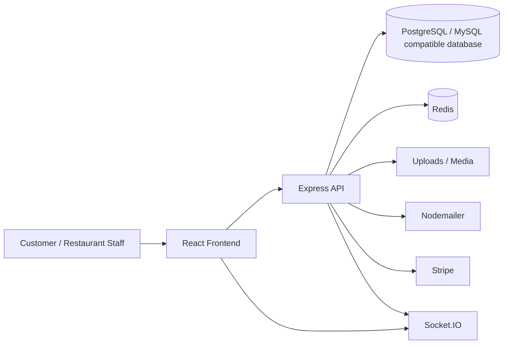
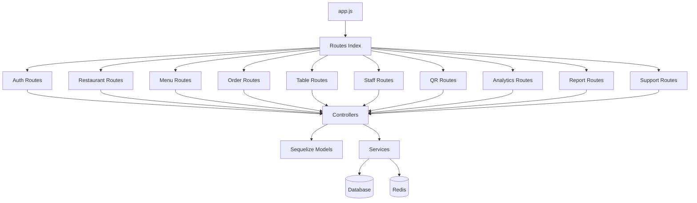
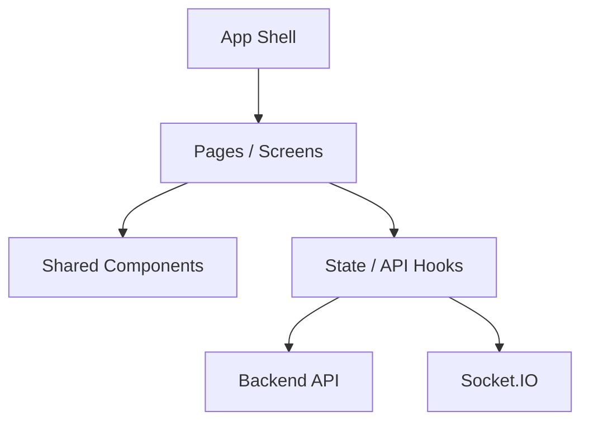
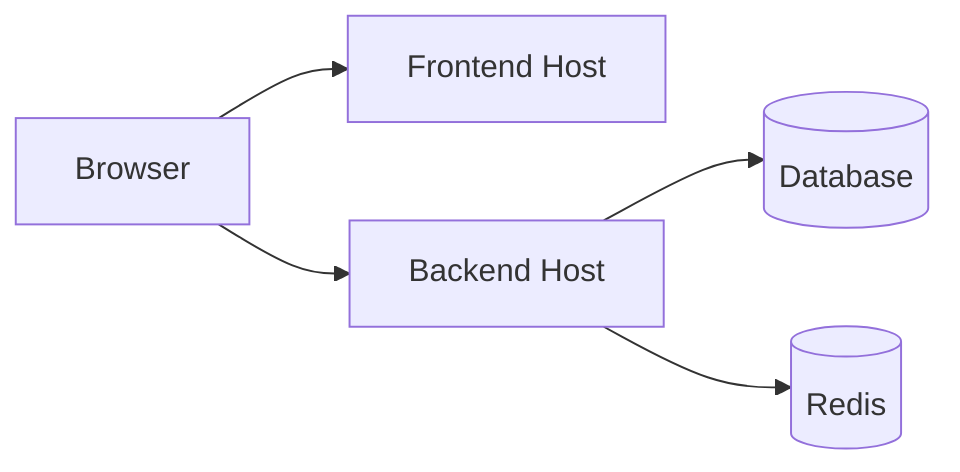

# MenuGo Architecture Diagram

## System Overview

```mermaid
flowchart LR
    User[Customer / Restaurant Staff] --> Frontend[React Frontend]
    Frontend --> API[Express API]
    API --> DB[(PostgreSQL / MySQL compatible database)]
    API --> Cache[(Redis)]
    API --> Storage[Uploads / Media]
    API --> Mail[Nodemailer]
    API --> Payments[Stripe]
    Frontend --> Realtime[Socket.IO]
    API --> Realtime
```

## Backend Module View

```mermaid
flowchart TD
    App[app.js] --> Routes[Routes Index]
    Routes --> Auth[Auth Routes]
    Routes --> Restaurants[Restaurant Routes]
    Routes --> Menu[Menu Routes]
    Routes --> Orders[Order Routes]
    Routes --> Tables[Table Routes]
    Routes --> Staff[Staff Routes]
    Routes --> QR[QR Routes]
    Routes --> Analytics[Analytics Routes]
    Routes --> Reports[Report Routes]
    Routes --> Support[Support Routes]

    Auth --> Controllers[Controllers]
    Restaurants --> Controllers
    Menu --> Controllers
    Orders --> Controllers
    Tables --> Controllers
    Staff --> Controllers
    QR --> Controllers
    Analytics --> Controllers
    Reports --> Controllers
    Support --> Controllers

    Controllers --> Models[Sequelize Models]
    Controllers --> Services[Services]
    Services --> DB[(Database)]
    Services --> Cache[(Redis)]
```

## Frontend View

```mermaid
flowchart TD
    AppShell[App Shell] --> Pages[Pages / Screens]
    Pages --> Components[Shared Components]
    Pages --> State[State / API Hooks]
    State --> API[Backend API]
    State --> Socket[Socket.IO]
```

## Deployment View

```mermaid
flowchart LR
    Client[Browser] --> CDN[Frontend Host]
    Client --> APIHost[Backend Host]
    APIHost --> DB[(Database)]
    APIHost --> Redis[(Redis)]
```
