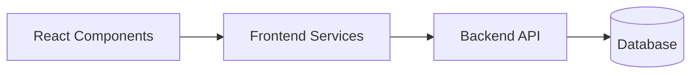
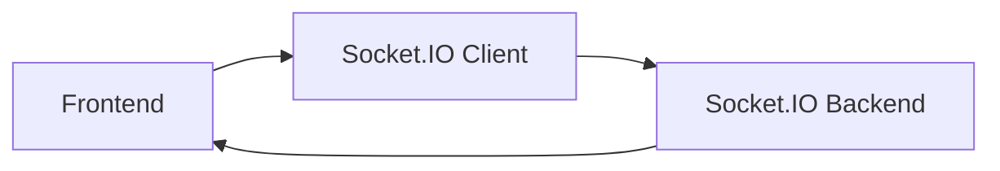

# MenuGo Frontend Technical Report

## 1. Purpose of the Frontend

The frontend is the user-facing layer of the MenuGo platform. It provides the web experience for restaurants, staff, and customers to interact with digital menus, tables, orders, analytics, and account management.

The React/Vite application is located in [menugo-frontend](menugo-frontend) and is designed to work with the backend API exposed by [menugo-backends](menugo-backends).

## 2. Frontend Architecture

The frontend follows a component-driven architecture with separate concerns for:

- routing and navigation
- reusable UI components
- data fetching and state management
- feature pages and screens
- API and socket integration

### 2.1 Main Structure

Key frontend areas include:

- app shell and routing: [menugo-frontend/src](menugo-frontend/src)
- shared components: [menugo-frontend/src/components](menugo-frontend/src/components)
- pages/screens: [menugo-frontend/src/pages](menugo-frontend/src/pages)
- services and integrations: [menugo-frontend/src/services](menugo-frontend/src/services)

## 3. Technology Stack

The frontend uses a modern React ecosystem:

- React 18 for UI rendering
- Vite for fast development and builds
- Tailwind CSS for styling
- React Router for navigation
- React Query for server-state management
- Zustand for local/global state
- Socket.io client for real-time features
- Recharts for charts and analytics
- Framer Motion for animations

## 4. Application Responsibilities

### 4.1 Customer Experience

The frontend supports customer-facing flows such as:

- browsing restaurant menus
- viewing categories and menu items
- interacting with the digital menu experience
- accessing QR-based restaurant entry points

### 4.2 Restaurant Management Experience

The app also supports restaurant-owner and staff workflows, including:

- dashboard access
- menu and restaurant management
- order monitoring
- table and waiter interactions
- analytics and reporting screens

## 5. Data Flow

The frontend communicates with the backend via HTTP APIs and real-time sockets.

### 5.1 Request Flow

### 5.2 Real-Time Flow

## 6. State Management Approach

The frontend uses a combination of:

- component-local state for UI behavior
- global or shared state for auth and app-wide context
- remote data fetching for backend-driven information

This separation helps keep UI logic maintainable while allowing the app to react to server updates.

## 7. Component Design Principles

The frontend is expected to follow practical UI patterns such as:

- reusable presentational components
- feature-specific container components
- clear separation between layout and business logic
- modular pages for each major domain

## 8. Integration Points

The frontend depends on several backend capabilities:

- authentication and user sessions
- restaurant and menu APIs
- orders and tables endpoints
- analytics and reports
- file upload endpoints
- real-time notifications and updates

## 9. Quality and Maintainability

To keep the frontend maintainable, the project should continue to emphasize:

- clear component boundaries
- reusable hooks and services
- consistent folder structure
- documentation for major flows
- tests for critical screens and interactions

## 10. Frontend Improvement Opportunities

Potential improvements include:

- documenting UI page flows in more detail
- adding route-level documentation
- expanding component story/test coverage
- formalizing API client wrappers
- improving error handling for failed network requests

## 11. Conclusion

The frontend is the main interaction layer for the MenuGo platform. Built with React and Vite, it connects users to the backend services through APIs and real-time communication, and it plays a central role in the complete restaurant management experience.
