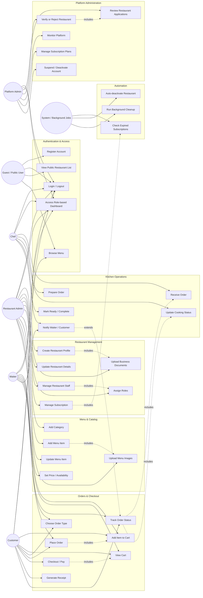

# MenuGo Full Actor-Use-Case View

This document expands the MenuGo use-case model into a complete actor-to-use-case view, showing which roles perform which actions and how the system responsibilities are divided.

## 1) Actors and responsibilities

### Guest / Public User
- Visits the public website.
- Views restaurant listings and menu items.
- Registers as a customer or restaurant owner.
- Accesses public information without authentication.

### Customer
- Registers and signs in.
- Browses restaurants and menu items.
- Adds items to cart.
- Places orders and completes checkout.
- Tracks order status and receives receipts.

### Restaurant Admin
- Owns or manages a restaurant account.
- Creates restaurant profile and settings.
- Uploads business documents for verification.
- Configures menu, categories, item pricing, and availability.
- Manages staff roles and permissions.
- Oversees subscription plan and restaurant activation status.

### Waiter
- Logs in to a restaurant staff dashboard.
- Assists customers with ordering and service.
- Manages table orders and order progress.
- Communicates with the kitchen and customer about status updates.

### Chef
- Receives kitchen orders.
- Prepares meals and updates their cooking status.
- Marks items as ready or completed.
- Coordinates with waiting staff.

### Platform Admin
- Monitors the platform and restaurant lifecycle.
- Reviews registrations and verifies or rejects restaurants.
- Manages global subscription plans and policy decisions.
- Suspends or reactivates accounts when needed.

### System / Background Jobs
- Runs scheduled system tasks.
- Checks subscription expiry automatically.
- Deactivates expired accounts or restaurants.
- Performs cleanup and maintenance.

---

## 2) Use-case model

---

## 3) Full actor-use-case matrix

| Actor | Main actions | Primary modules involved |
|---|---|---|
| Guest / Public User | Register, login, browse restaurants, browse menu | Authentication, public storefront |
| Customer | Search restaurants, view menu, add items, place order, checkout, track order | Ordering, menu, cart, checkout |
| Restaurant Admin | Create restaurant, upload docs, manage menu, assign staff, manage subscription | Restaurant management, menu, staff, subscription |
| Waiter | View orders, assist checkout, track status, send updates to kitchen | Order management, kitchen communication |
| Chef | Receive orders, prepare food, update cooking status, mark ready | Kitchen module, order lifecycle |
| Platform Admin | Verify restaurants, monitor platform, manage plans, suspend accounts | Platform admin, subscription, compliance |
| System / Background Jobs | Expire subscriptions, deactivate accounts, run cleanup | Cron jobs, automation, maintenance |

---

## 4) Detailed use-case actions by role

### Guest / Public User
1. Register an account.
2. Log in to the application.
3. View available restaurants.
4. Browse restaurant menus without full account access.

### Customer
1. Log in to the platform.
2. Browse restaurant and menu listings.
3. Add food items to cart.
4. Select order type (dine-in, takeaway, etc.).
5. Place the order.
6. Complete checkout/payment.
7. View receipt and order status.

### Restaurant Admin
1. Create and configure restaurant profile.
2. Provide business information and upload verification documents.
3. Manage staff assignments (waiters, chefs, admin roles).
4. Add categories and menu items.
5. Set pricing, stock, and availability.
6. Monitor restaurant activity and order flow.
7. Manage subscription plans and expiration status.

### Waiter
1. Sign in to the staff dashboard.
2. View active orders and table status.
3. Assist customers during ordering and checkout.
4. Confirm and track order progress.
5. Notify kitchen and communicate status updates.

### Chef
1. Sign in to the kitchen dashboard.
2. Receive incoming orders.
3. Start preparation and update progress.
4. Mark dishes as ready for pickup/delivery.
5. Notify waiters or customers when complete.

### Platform Admin
1. Access the platform admin dashboard.
2. Review pending restaurant registrations.
3. Verify, reject, or ask for more information.
4. Monitor account health and platform activity.
5. Manage subscription policies and pricing.
6. Suspend or deactivate restaurants/accounts.

### System / Background Jobs
1. Check subscription dates on a schedule.
2. Trigger deactivation when a restaurant or user is expired.
3. Run data cleanup and maintenance updates.
4. Keep the platform state consistent without manual intervention.

---

## 5) Functional grouping summary

### Core business functions
- Registration and authentication
- Restaurant lifecycle and verification
- Menu management
- Cart and ordering
- Kitchen and service flow
- Platform governance
- Subscription automation

### Supporting functions
- File upload management
- Role-based access control
- Activity tracking
- Background maintenance tasks
- Invoice and receipt generation

---

## 6) Short requirement-style summary

The MenuGo system must support:
- public browsing for guests,
- customer ordering workflows,
- restaurant owner management and menu configuration,
- staff operations for waiters and chefs,
- platform-level verification and oversight,
- and automated subscription/account lifecycle processing.

This creates a complete restaurant SaaS ecosystem with clearly separated roles and responsibilities.
